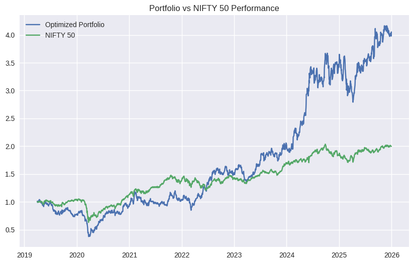

# Portfolio Optimization using Modern Portfolio Theory

##  Overview

This project implements a portfolio optimization framework using Modern Portfolio Theory (MPT) combined with Monte Carlo simulation on Indian equities. The objective is to construct an optimal portfolio that maximizes risk-adjusted returns and compare its performance with the NIFTY 50 index.

---

##  Methodology

- Data collected using Yahoo Finance (`yfinance`)
- Computed log returns of selected stocks
- Constructed covariance matrix and expected returns
- Simulated thousands of portfolios using Monte Carlo methods
- Approximated the efficient frontier
- Identified optimal portfolio using maximum Sharpe ratio

---

## Benchmark Comparison

The optimized portfolio is compared against the NIFTY 50 index using:
- Annual Return  
- Volatility  
- Sharpe Ratio  
- Cumulative Returns  

---

##  Results

- The optimized portfolio significantly outperformed the benchmark
- However, it exhibited higher volatility and deeper drawdowns
- Demonstrates the risk-return tradeoff in portfolio optimization

---
## Portfolio vs NIFTY 50

##  Key Insights

- Higher returns come with increased risk
- Portfolio performance is sensitive to market conditions
- Mean-variance optimization may suffer from overfitting

---

##  Limitations
- Assumes stable covariance structure
- Ignores transaction costs
- Based on historical data only

---

##  Future Improvements

- Add portfolio rebalancing
- Incorporate Black-Litterman model
- Include real-world constraints

---

##  Tech Stack
- Python  
- Pandas, NumPy  
- Matplotlib  
- yfinance  
